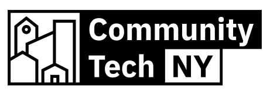

## Don't Panic, Organize!
Explore the role of community wireless networks, small businesses, and neighborhood anchor institutions in fostering resilient, sustainable neighborhoods. This workshop will examine how local networks can support communities during disasters and how key neighborhood players contribute to long-term sustainability and resilience.

Images of local servers conversations, from Don't Panic Organize workshops.

 

### Objectives:
- Participants will use community organizing to develop social networks that strengthen bonds within each neighborhood.
- Participants will lead their neighborhoods in the creation of an emergency communication protocol.
- Participants will know the working principles of Digital Stewards and create methods in which they can be practiced throughout their projects.
- Participants will create sustainability and resilience plans that utilize their community wireless network and the Portable Network Kit.
- Participants will understand how surveying community needs ties to network design and function.
- Participants will understand the power of effective communication and how communication networks help promote strong bonds and unity, especially during disasters.
  
**Workshop Duration:** 90 minutes

## Neighborhood Resilience Guidelines
This series of guides helps communities prepare collectively, moving beyond individual preparedness to foster neighborhood-wide resilience. Learn how to organize inclusive gatherings that bring together diverse groups, using networks like block captains, PTAs, and faith-based organizations to ensure everyone is involved and informed.

Community members mapping local assets during a preparedness workshop.

 

If you are interested in these resources for your community, please get in touch with Community Tech NY @ **info@communitytechny.org**
  

